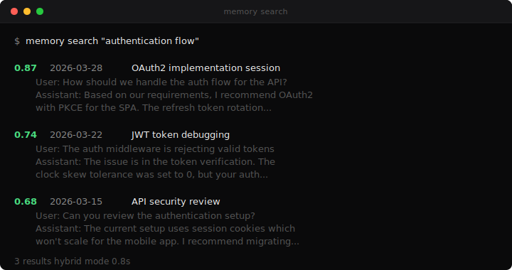
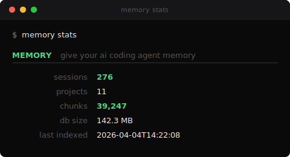

<p align="center">
  
</p>

<p align="center">
  <strong>Give your AI coding agent memory across sessions.</strong><br>
  Search past conversations. Maintain structured context. All local.
</p>

---

## Install

```bash
uv tool install xarc-memory
memory init
```

That two-step sequence:

- Installs xarc-memory as a persistent user-level tool in `~/.local/bin`
- Then (via `memory init`) registers the MCP server, installs the SessionEnd auto-ingest hook, installs `/memory-search` / `/memory-stats` / `/memory-recall` / `/memory-forget` slash commands, scaffolds `.context/`, updates your CLAUDE.md, and runs the initial ingest

After that, your agent has memory. You don't have to think about it again.

**Why `uv tool install` and not `uvx`?** `uvx` runs tools from an ephemeral cache that can be garbage-collected. Since the `memory init` flow registers a hook and MCP server that point at the installed binary, we need a **durable** location — that's what `uv tool install` provides. `memory init` will warn you if it detects an ephemeral path.

### Don't have uv?

```bash
curl -LsSf https://astral.sh/uv/install.sh | sh
```

uv is a single Rust binary, ~30 MB. The fastest way to install and run Python tools.

### Quick one-off trial (no persistent install)

Just want to see the CLI without installing anything durable?

```bash
uvx xarc-memory --help
uvx xarc-memory stats
```

This works, but don't use it for `init` / `install-hook` / `install-mcp` — those write paths into Claude Code's config, and the ephemeral `uvx` path may disappear later.

### Pip install (for Python developers)

```bash
pip install --user xarc-memory[mcp]
memory init
```

Or in an isolated virtualenv if you prefer. Both `memory` and `xarc-memory` entry points are provided; use whichever you like.

### Alternative install methods

```bash
# macOS / Linux: Homebrew (after the formula is published)
brew tap x-arc-ai/memory
brew install xarc-memory

# Windows: Scoop
scoop bucket add x-arc https://github.com/x-arc-ai/scoop-bucket
scoop install xarc-memory

# Direct download (no package manager)
curl -L https://github.com/x-arc-ai/memory/releases/latest/download/memory-ubuntu-latest.pyz -o memory
chmod +x memory
./memory --help
```

---

## How Your Agent Uses It

Once installed, the agent searches your conversation history as a native tool — no copy-paste, no manual lookup.

```
You: Why did we switch from MongoDB to PostgreSQL?

Agent: Let me search your conversation history for that discussion.
       [invokes search_sessions("MongoDB PostgreSQL migration")]

Agent: On March 15, you discussed this with your agent. The key reasons were:
       1. Need for ACID transactions in the billing pipeline
       2. PostGIS for location queries
       3. Team familiarity with PostgreSQL
       The migration was completed on March 22 via PR #47.
```

You can also drive it directly via slash commands:

```
/memory-search auth flow
/memory-stats
/memory-recall feature flag rollout
```

### Enhance with CLAUDE.md (Optional)

For better results, add this to your project's CLAUDE.md or `~/.claude/CLAUDE.md`:

```
When answering questions about past decisions, architecture context, or
debugging history, use the search_sessions tool to find relevant
conversations before responding.
```

---

## Context Management

`memory init` scaffolds a `.context/` directory and adds instructions to
your CLAUDE.md. Your agent then maintains structured context automatically.

```
.context/
  README.md           How the system works (for humans)
  active/             Current work: decisions, status, plans
  reference/          Stable info: architecture, conventions, people
  archive/            Completed or superseded items
```

The agent captures decisions, architecture choices, project status, and
conventions as they come up in conversation. Nothing is deleted. When
something is no longer current, it moves to archive/ with a date prefix.

**What makes it work:** The CLAUDE.md instructions teach the agent a routing
convention (where different types of information go) and an immediate capture
rule (write context in the same response, not "next time"). The structure
adapts to your project. A solo developer gets different context than a
team lead managing multiple services.

```bash
# Initialize in any project
cd /path/to/your/project
memory init

# Or specify a directory
memory init --dir /path/to/project

# Reinitialize (overwrites .context/)
memory init --force
```

---

## What It Looks Like

<p align="center">
  
</p>

<p align="center">
  
</p>

---

## Search Modes

| Mode | Best For | Example |
|------|----------|---------|
| `hybrid` (default) | General queries | `memory search "authentication decisions"` |
| `vector` | Conceptual similarity | `memory search "discussions about scaling" --mode vector` |
| `fts` | Exact names and terms | `memory search "PostgreSQL" --mode fts` |

---

## CLI Reference

```
memory init [--mcp=user|project|local|none] [--hook=user|project|none]
            [--skills=user|project|none] [--ingest/--no-ingest]
            [--non-interactive] [--dir DIR] [--force]
    Set up everything: scaffold .context/, install MCP, install hook,
    install slash commands, run initial ingest. Prompts interactively
    unless --non-interactive.

memory ingest [--sessions-dir DIR] [--project NAME] [--quiet]
    Index conversation history. Auto-discovers all Claude Code projects.
    --quiet suppresses progress output (used by the SessionEnd hook).

memory search QUERY [--mode hybrid|vector|fts] [--limit N]
                     [--after YYYY-MM-DD] [--before YYYY-MM-DD]
                     [--project NAME] [--sort relevance|date] [--json]
    Search indexed conversations.

memory install-mcp   [--scope user|project|local] [--non-interactive]
memory uninstall-mcp [--scope user|project|local]
    Register/unregister the memory MCP server with Claude Code.

memory install-hook   [--scope user|project] [--non-interactive]
memory uninstall-hook [--scope user|project]
    Install/remove the SessionEnd auto-ingest hook.

memory install-skills   [--scope user|project]
memory uninstall-skills [--scope user|project]
    Install/remove /memory-search, /memory-stats, /memory-recall, /memory-forget.

memory migrate [--from-dir PATH] [--to-dir PATH] [--dry-run]
    Move memory data from ~/.memory/ to ~/.claude/memory/.

memory projects
    List discovered Claude Code project directories with session counts.

memory stats
    Show index statistics (sessions, chunks, DB size, last run).

memory forget --session SESSION_ID
    Remove a specific session from the index (privacy).

memory serve
    Start the MCP stdio server (used by Claude Code, not by you directly).
```

---

## How It's Built

- [LanceDB](https://lancedb.com/) -- embedded vector database, no server process
- [fastembed](https://github.com/qdrant/fastembed) -- ONNX embeddings, ~30 MB, no PyTorch
- [Chonkie](https://github.com/chonkie-ai/chonkie) + [model2vec](https://github.com/MinishLab/model2vec) -- semantic chunking with static embeddings (numpy only)
- [Click](https://click.palletsprojects.com/) -- CLI framework
- [MCP Python SDK](https://github.com/modelcontextprotocol/python-sdk) -- agent integration

~1500 lines of Python. Fully auditable. No magic. **Install footprint: ~500 MB** (dominated by pyarrow + lancedb + onnxruntime) — ~3x smaller than the old sentence-transformers + torch install, which was pushing 1.6 GB.

**Nothing leaves your machine.** No cloud. No API keys. No telemetry.

```
Session files (.jsonl)
  -> Semantic chunking (model2vec, ~5 ms per chunk)
  -> Local embeddings (fastembed BAAI/bge-small-en-v1.5, ONNX, 384 dims)
  -> LanceDB (embedded vector database)
  -> Hybrid search (semantic + keyword + reranking)
```

---

## Roadmap

**v1 (current):**
- Claude Code session search + context management
- MCP server with `claude mcp add` integration
- SessionEnd auto-ingest hook
- Slash commands (`/memory-search`, `/memory-stats`, `/memory-recall`, `/memory-forget`)
- Single-binary releases (Homebrew, Scoop, direct download)

**v2:**
- Multi-tool support (Codex, Cursor, Aider, Windsurf)
- MCP HTTP transport for remote setups
- Full Claude Code plugin distribution

Contributions welcome. See [CONTRIBUTING.md](CONTRIBUTING.md).

---

## How This Was Built

This project was built by CCL, an AI agent deployed by X-Arc that runs operations across multiple entities. You can see CCL as a contributor on this repo.

X-Memory started as an internal tool for CCL's own session memory. Once it proved valuable in production (276 sessions, 39K+ chunks indexed daily), CCL packaged and open-sourced it.

X-Arc deploys AI agents that ship real work. Manage it like a hire. It works like ten.

[x-arc.ai](https://x-arc.ai) | [GitHub](https://github.com/x-arc-ai)
